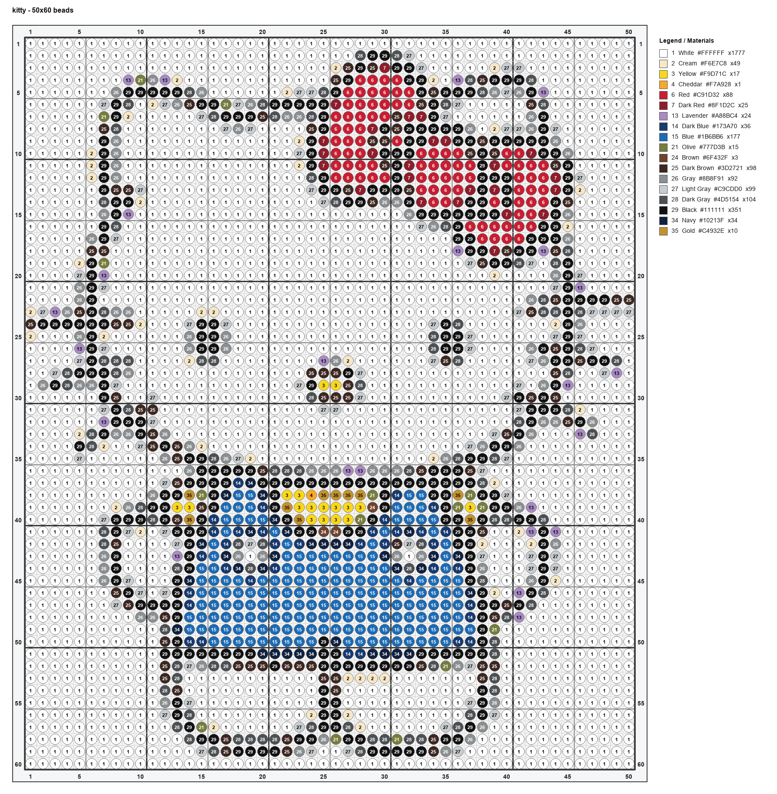
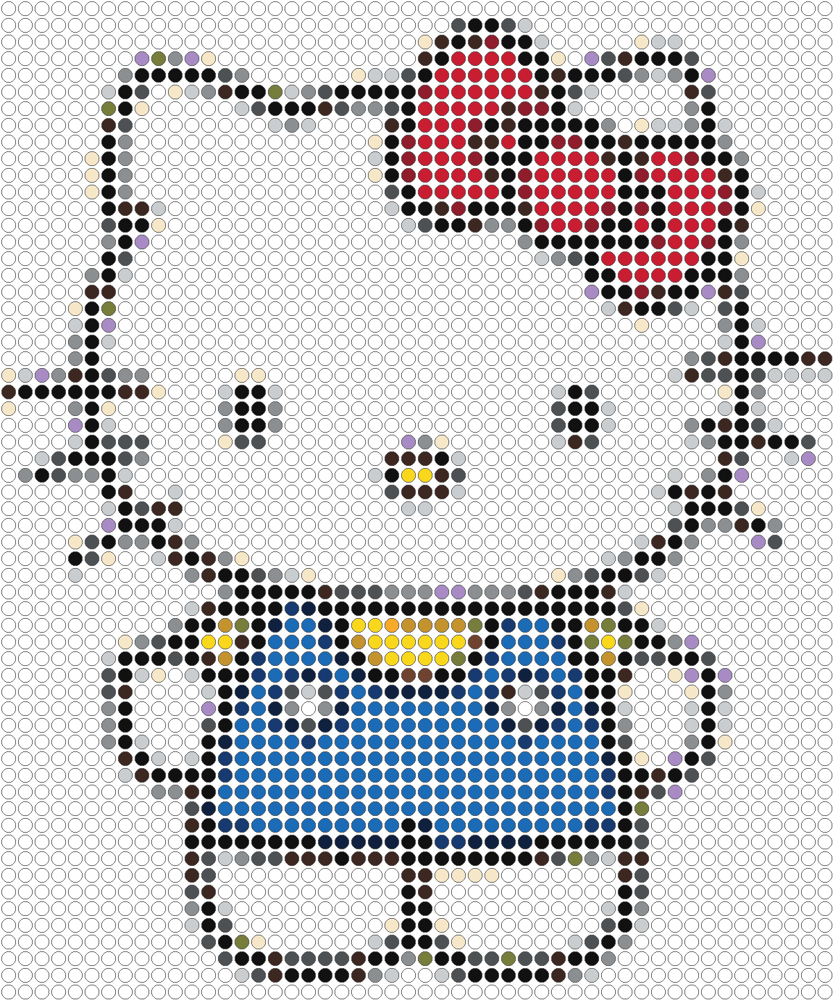

# Perler Beads Pattern Generator

Generate numbered Perler Beads pattern sheets from reference images. The tool resizes an input image to a bead grid, maps pixels to a user-controlled color palette, and writes a pattern sheet, preview image, grid matrix, and material list.

## Preview

| Pattern sheet | Bead preview |
| --- | --- |
|  |  |

## Features

- Supports PNG, JPG, WEBP, and other image formats readable by Pillow.
- Supports fixed width and height, width-only, or height-only bead grids.
- Produces dense patterns by default: transparent pixels are composited onto a background color so every grid cell becomes a bead.
- Supports custom CSV and JSON palettes.
- Prints the palette code on each bead unit.
- Adds row/column coordinate labels around the pattern sheet.
- Draws heavier guide lines every 5 and 10 cells by default.
- Renders bead units as circles or squares.
- Exports a numbered pattern PNG, preview PNG, matrix CSV, material CSV, and material JSON.

## Repository Layout

```text
.
|-- perler_pattern.py              # CLI tool
|-- assets/                        # README images
|-- examples/kitty.png             # Example input image
|-- palettes/                      # Built-in palettes
|-- environment.yml                # Conda environment
|-- requirements.txt               # pip dependency list
|-- .github/workflows/ci.yml       # GitHub Actions smoke test
|-- LICENSE                        # MIT License
`-- README.md
```

Generated files are written to `examples/output/` by default and ignored by `.gitignore`.

## Installation

Using conda:

```bash
conda env create -f environment.yml
conda activate perler-beads
```

Using venv and pip:

```bash
python -m venv .venv
source .venv/bin/activate
pip install -r requirements.txt
```

## Quick Start

```bash
python perler_pattern.py examples/kitty.png --size 50x60 --cell-size 28
```

Generated outputs:

- `*_pattern.png`: numbered pattern sheet with a material legend
- `*_preview.png`: bead-style preview image
- `*_matrix.csv`: grid cells mapped to palette codes
- `*_materials.csv`: palette code, name, HEX value, and bead count
- `*_materials.json`: machine-readable material list

## Common Usage

Set the width and calculate height from the source image aspect ratio:

```bash
python perler_pattern.py input.jpg \
  --size 80x \
  --palette palettes/starter_perler.csv \
  --fit contain \
  --cell-size 24 \
  --bead-shape circle \
  --background "#FFFFFF"
```

Render square bead units:

```bash
python perler_pattern.py input.png --size 80x60 --bead-shape square
```

Hide the right-side legend to reduce output image width:

```bash
python perler_pattern.py input.png --size 80x60 --no-legend
```

Use only the first 12 colors from the palette:

```bash
python perler_pattern.py input.png --size 80x60 --max-colors 12
```

Use a different built-in palette:

```bash
python perler_pattern.py input.png --size 80x60 --palette palettes/pixel_art_16.csv
```

Skip beads for the background color:

```bash
python perler_pattern.py input.png --size 80x60 --background "#FFFFFF" --empty-background
```

Skip beads for specific palette codes or HEX colors:

```bash
python perler_pattern.py input.png --size 80x60 --empty-color 1 --empty-color "#FFFFFF"
```

## Key Options

- `--size 80x60`: create an 80-column by 60-row bead grid.
- `--size 80x`: set width only and calculate height from the source image aspect ratio.
- `--size x60`: set height only and calculate width from the source image aspect ratio.
- `--fit contain`: keep the full source image. Extra space uses `--background` by default, or empty cells with `--allow-empty-transparent`.
- `--fit cover`: fill the target grid and crop edges when needed.
- `--fit stretch`: stretch the source image to the target grid.
- `--cell-size 24`: render each bead unit as 24 pixels in the output PNG. This controls output resolution, not bead count.
- `--major-grid 5`: draw heavier guide lines and coordinate labels every 5 cells.
- `--super-grid 10`: draw the heaviest guide lines every 10 cells.
- `--bead-shape circle`: render pattern and preview bead units as circles.
- `--bead-shape square`: render pattern and preview bead units as squares.
- `--palette`: use a custom palette file.
- `--max-colors`: use only the first N colors from the palette.
- `--background`: composite transparent pixels and `contain` padding onto this color before palette matching, unless `--allow-empty-transparent` is set.
- `--allow-empty-transparent`: let transparent pixels become empty cells, including transparent padding created by `--fit contain`. By default, patterns are dense and every cell is a bead.
- `--transparent-alpha`: alpha threshold used with `--allow-empty-transparent`.
- `--empty-background`: treat the palette color nearest to `--background` as empty cells after palette matching.
- `--empty-color`: treat a palette code or HEX color as empty cells after palette matching. Can be repeated.
- `--no-grid`: hide grid lines on the pattern sheet.
- `--no-legend`: hide the material legend on the pattern sheet.
- `--title`: set a custom pattern title.

## Output Resolution

The pattern PNG resolution is mainly controlled by `--size` and `--cell-size`:

```text
pattern width  ~= grid columns * cell-size + coordinate frame + margins + legend width
pattern height ~= max(grid rows * cell-size + coordinate frame, legend height) + title area + margins
```

For example, `--size 40x46 --cell-size 24` produces a higher-resolution image than `--size 40x46 --cell-size 16`, while keeping the same bead count. Use `--no-legend` to reduce the extra width added by the legend.

## Empty Cells

There are two ways to create cells that do not require beads:

- Use `--allow-empty-transparent` when the source image has real transparency and you want transparent pixels to stay empty.
- Use `--empty-background` or `--empty-color` when the source image has a visible background color, such as white, that should not be counted as beads.

For transparent PNG/WebP artwork, `--allow-empty-transparent` is usually the cleanest option. For JPGs, screenshots, scans, or images with solid backgrounds, color-based empty cells are usually more predictable.

## Custom Palette

Built-in palettes:

- `palettes/starter_perler.csv`: broad starter palette for general use.
- `palettes/classic_bright.csv`: saturated high-contrast colors.
- `palettes/soft_pastel.csv`: lighter pastel colors for gentle illustrations.
- `palettes/pixel_art_16.csv`: compact 16-color palette for retro pixel-art patterns.
- `palettes/grayscale.csv`: black-to-white grayscale palette.
- `palettes/skin_hair_natural.csv`: skin, hair, and natural tones for portraits and characters.

CSV with HEX colors:

```csv
code,name,hex
1,White,#FFFFFF
2,Black,#111111
3,Red,#C91D32
```

CSV with RGB columns:

```csv
code,name,r,g,b
W,White,255,255,255
K,Black,17,17,17
```

JSON:

```json
[
  {"code": "1", "name": "White", "hex": "#FFFFFF"},
  {"code": "2", "name": "Black", "hex": "#111111"}
]
```

The `code` value is printed directly on each bead, so short numbers or letters work best.

## License

This project is licensed under the MIT License. See [LICENSE](LICENSE).

## Notes

- The included palettes are practical starter palettes, not official complete color charts from any manufacturer.
- `examples/kitty.png` is included as an example input image for quick CLI testing.
